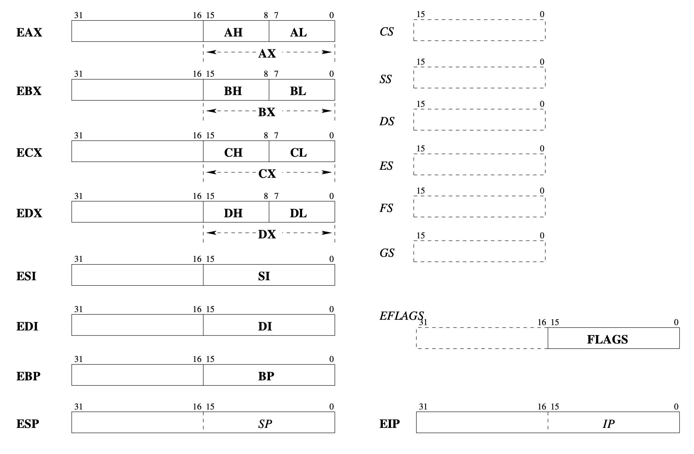

# libasm

increment REG_NAME register value

```assembly language
inc REG_NAME
```

compares 2 values

```assembly language
cmp REG_NAME, 5
```

command `jl` means "JUMP if LOWER", works based on results of `cmp`. 

## The Registers

