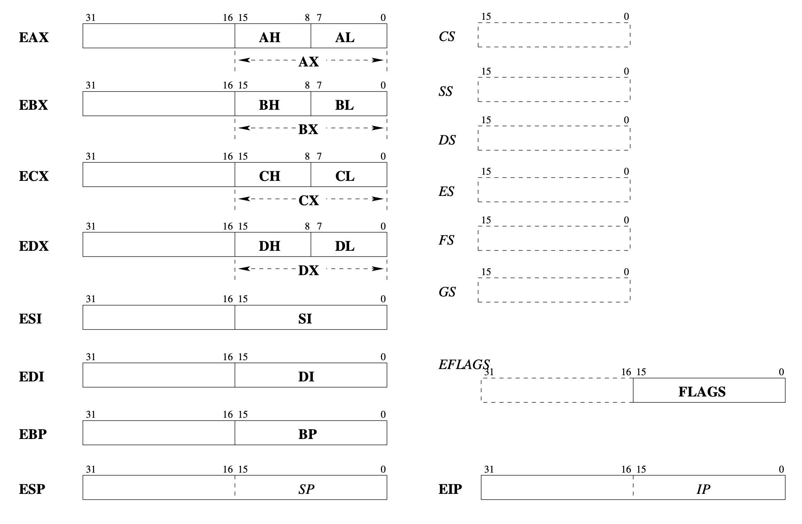

# libasm

increment REG_NAME register value

```assembly language
inc REG_NAME
```

compares 2 values

```assembly language
cmp REG_NAME, 5
```

command `jl` means "JUMP if LOWER", works based on results of `cmp`. 

## The Registers



#### Easy to remember tip
H AND L in all 8-bit registers means HIGH and LOW. \n

X means H and L parts of each registers are combined. `EX. AH + AL = AX = 16 bits`

E is 32-bit register where E means EXTENDED (the same as X but with 2x more memory) `EX. (AH + AL) * 2 = EAX = 32 bits`